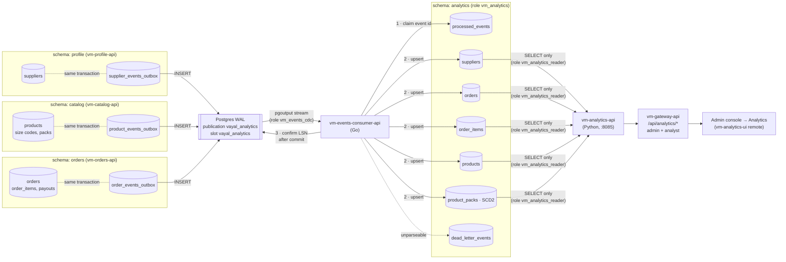

# Analytics: outbox + CDC

How a supplier, product or order change becomes a row on the Analytics page: written
once, streamed once, applied exactly once, with no personal data on the way.

Contract: CLAUDE.md §5.4. This document explains how it works and how to run it.

---

## The picture



The same picture as plain text, for terminals and code review:

```
 vm-profile-api           vm-catalog-api            vm-orders-api
 ┌──────────────────────┐ ┌───────────────────────┐ ┌──────────────────────┐
 │ BEGIN                │ │ BEGIN                 │ │ BEGIN                │
 │  UPDATE suppliers …  │ │  UPDATE products …    │ │  UPDATE orders …     │
 │  INSERT supplier_    │ │  INSERT product_      │ │  INSERT order_       │
 │    events_outbox     │ │    events_outbox      │ │    events_outbox     │
 │ COMMIT               │ │ COMMIT                │ │ COMMIT               │
 └──────────┬───────────┘ └───────────┬───────────┘ └──────────┬───────────┘
            └─────────────────────────┼────────────────────────┘
                                  ▼
                 ┌──────────────────────────────────┐
                 │ Postgres WAL                     │
                 │ publication vayal_analytics      │  INSERTs only
                 │ slot vayal_analytics             │  keeps WAL until confirmed
                 └────────────────┬─────────────────┘
                                  │ logical replication (pgoutput)
                                  ▼
                 ┌──────────────────────────────────┐
                 │ vm-events-consumer-api  :8084    │
                 │ one source txn → one analytics   │
                 │ txn, then confirm the LSN        │
                 └────────────────┬─────────────────┘
                                  ▼
 ┌─────────────────────────── schema: analytics ───────────────────────────┐
 │ processed_events ── "have I applied this event id before?"              │
 │        │ new                                     │ seen → skip          │
 │        ▼                                                                │
 │ suppliers   orders ── order_items   products ── product_packs (versions)│
 │ dead_letter_events  (events no retry can fix)                           │
 └────────────────────────────────┬────────────────────────────────────────┘
                                  │ SELECT only (vm_analytics_reader)
                                  ▼
          vm-analytics-api :8085 → gateway /api/analytics/* → Analytics tab
```

---

## Step by step

### 1. The change and its event commit together

Every place that changes a supplier, a product or an order's status also inserts one row
into its service's outbox table, **in the same transaction**:

| Table | Written by | Events |
|---|---|---|
| `profile.supplier_events_outbox` | vm-profile-api `internal/analyticsevents` | `supplier.applied` (self-signup), `supplier.created` (by an admin), `supplier.updated`, `supplier.approved`, `supplier.rejected`, `supplier.suspended`, `supplier.snapshot` |
| `catalog.product_events_outbox` | vm-catalog-api `internal/analyticsevents` | `product.created` (form or CSV import), `product.updated`, `product.markup_changed`, `product.archived`, `product.snapshot` |
| `orders.order_events_outbox` | vm-orders-api `internal/analyticsevents` | `order.placed`, `order.paid`, `order.expired`, `order.cancelled`, `order.processed`, `order.dispatched`, `order.snapshot` |

Because they share a transaction, a status change that commits always has its
event, and one that rolls back never does. There is no "the order moved but
analytics never heard" window, and no dual write that can half-succeed.

`order.paid` is emitted inside `applyOrderPaid`, the single function every
payment path goes through: the Razorpay webhook, an admin recording a manual
payment, and a scheduled order paid from the wallet.

All three tables are **insert-only**. They are separate from `orders.outbox`, which
is the email/alert work queue and is updated constantly as rows are claimed
and retried. Streaming that table would turn every update into analytics
noise.

### 2. The payload is the whole thing, minus anything personal

Each event carries the full aggregate *after* the change: the order with its
lines and payouts, the product with its grades and priced packs, or the
supplier's business name, status, town and commission. The
consumer therefore upserts state rather than replaying deltas, so a missed or
out-of-order event still converges on the right row.

Payloads are built from typed Go structs that **have no field** for names,
phones, emails, street addresses, landmarks, Razorpay/bank references,
descriptions, cancel or rejection reasons. A supplier's contact person,
phone, email, PAN, GSTIN and bank details stay in profile; analytics gets the
business name and town the storefront already shows, and a `gst_registered`
flag rather than the number. Delivery location is kept to city/state/pincode. Tests pin the order and supplier payloads' keys to an allow-list, so
adding a field is a deliberate decision about what the analytics role may see.

### 3. Postgres streams the inserts

- `wal_level=logical` (set in `infra/docker-compose.yml`).
- Publication `vayal_analytics` covers exactly the three outbox tables, with
  `publish = 'insert'`, so the retention `DELETE` that later prunes old rows
  never reaches the consumer.
- Replication slot `vayal_analytics` (pgoutput) remembers how far the
  consumer has confirmed and keeps WAL until it does. `max_slot_wal_keep_size`
  caps that, so a consumer that is gone for good cannot fill the disk.
- The stream is read by `vm_events_cdc`, a `REPLICATION` login with **no grant
  on any table**. It can read the WAL and nothing else.

### 4. The consumer applies each transaction once

`vm-events-consumer-api` groups pgoutput messages by source transaction
(BEGIN … INSERTs … COMMIT). For each transaction it:

1. opens **one** analytics transaction;
2. for each event, inserts its id into `processed_events`. If the id is
   already there, the event is a duplicate and is skipped;
3. projects the event into `suppliers`, `orders`/`order_items` or `products`/`product_packs`
   inside a savepoint;
4. commits;
5. **only then** confirms that transaction's LSN to Postgres.

### 5. Why `processed_events` exists

Replication delivers **at least once**. The consumer confirms an LSN only
*after* its analytics transaction commits, which is what makes it safe. It
also means there is always a window where analytics has committed and Postgres
has not yet heard:

```
 analytics COMMIT ✔   ──crash/restart/network blip──▶   LSN never confirmed
                                                         │
 Postgres resends from the last confirmed LSN ◀──────────┘   → same events, again
```

Reconnects, deploys, `kill -9`, a sleeping laptop: each one replays whatever
was in flight. Without a guard:

- `order_items` and `product_packs` versions would be written twice;
- a replayed old event could roll a row back. For example, a replayed `paid`
  could arrive after `processed`;
- dashboards would quietly over-count.

`processed_events (event_id PRIMARY KEY)` is that guard. Claiming the id is the
first statement of the same transaction that applies the event, so:

| What happens | Result |
|---|---|
| First delivery | id inserted, event applied, both committed together |
| Replay after the commit | `ON CONFLICT DO NOTHING` returns no row, so the event is skipped |
| Crash before the commit | both roll back, so the replay applies it normally |

At-least-once delivery plus an idempotent apply gives exactly-once effect.

Two further guards cover the cases an event id cannot:

- **Stale state:** the upserts only overwrite a row if the event is at least
  as new as `last_event_at`, so a re-sent older snapshot cannot undo a later
  transition.
- **Lifecycle timestamps** (`paid_at`, `processed_at`, …) use `COALESCE`: the
  first time a transition is seen wins and is never cleared.

Ids are pruned after 30 days, which is far longer than any replay the
7-day source retention can produce.

### 6. Poison events don't block the stream

If an event can never be applied (an unknown `schema_version`, a payload that
does not parse, data a constraint rejects), it is written to
`dead_letter_events` with the error and the stream carries on. A transient
failure, such as the database going away, is different: the whole transaction
is retried and the LSN is not confirmed until it succeeds.

### 7. Reading it back

`vm-analytics-api` (Python, FastAPI) connects as `vm_analytics_reader`. That
role can `SELECT` from schema `analytics` and nothing else, and its sessions
are read-only. It cannot see a customer's name however a query is written.
The gateway serves it at `/api/analytics/*` to **admins and analysts only**.

---

## The analytics tables

| Table | Grain | Notes |
|---|---|---|
| `suppliers` | one per supplier | business name, status, city/state/pincode, `gst_registered`, commission bps, `approved_at`, `suspended_at` |
| `orders` | one per order | money in paise, status, payment method, `placed_date_ist`, `placed_before_cutoff`, `paid_at` / `processed_at` / `dispatched_at` / `cancelled_at` / `expired_at`, supplier payable, ship city/state/pincode |
| `order_items` | one per order line | product, grade, pack, qty, grams, unit price, line total, markup |
| `products` | one per product | status, markup bps, grade/pack counts, live customer price range, media counts, `first_active_at`, `archived_at` |
| `product_packs` | one per pack **version** (SCD type 2) | `valid_from` / `valid_to`; price history, and old `order_items.pack_option_id`s still resolve, because a product save replaces every pack id |
| `processed_events` | one per applied event id | the dedupe guard above |
| `dead_letter_events` | one per parked event | inspect and fix by hand |
| `v_order_lines`, `v_current_packs` | views | lines joined to their order and their supplier's name; packs on sale now |

Orders in OLTP have no `paid_at`/`processed_at` columns. Analytics gets them
from the time of the event that made the transition. Orders that came in by
backfill keep NULL for transitions that predate the outbox, rather than a
guessed value.

---

## Who can see what

| Role | Can reach | Used by |
|---|---|---|
| `vm_events_cdc` | the WAL stream only, no tables | consumer (reading) |
| `vm_analytics` | schema `analytics`, owner | consumer (writing), migrations |
| `vm_analytics_reader` | `SELECT` on `analytics`, read-only sessions | vm-analytics-api |
| app role **analyst** | `/api/me`, `/api/analytics/*` | Admin console → Analytics tab only |

None of the three database roles can reach `profile`, `catalog` or `orders`.
`infra/postgres/init/03-analytics.sh` and `infra/postgres/cdc-setup.sql`
assert this on every run.

---

## Running it

```bash
make -C infra dev          # roles → migrations → publication → all processes
```

`make migrate-up` (part of `dev`) provisions the analytics roles, migrates
every schema including `analytics`, then creates the publication **and the
replication slot**. The slot is made here rather than by the consumer: a slot
only sees changes made after it exists, so events written before the
consumer's first start (a backfill, the first orders after a deploy) would
otherwise be lost. On a new machine, `./scripts/dev-setup.sh` does all of this plus
the backfill.

**Backfill** existing suppliers, products and orders. They take the same CDC
path as live events:

```bash
(cd vm-profile-api && go run ./cmd/api -emit-snapshots)
(cd vm-catalog-api && go run ./cmd/api -emit-snapshots)
(cd vm-orders-api  && go run ./internal/devtools -emit-snapshots)
```

**Sign in as an analyst:** <http://localhost:5174> with `SEED_ANALYST_EMAIL` /
`SEED_ANALYST_PASSWORD` from `.env`. You see only the Analytics tab.

Which metric comes from which column: **[analytics-metrics.md](analytics-metrics.md)**.

## Verifying it

```bash
make -C infra test-go      # includes outbox emission, projector and CDC stream tests
make -C infra test-py      # vm-analytics-api, incl. "reader cannot see orders.orders"
curl -s -H "X-Internal-Token: $INTERNAL_SERVICE_TOKEN" localhost:8084/status   # connected, confirmed LSN
```

Reconcile analytics against the source (as the Postgres superuser):

```sql
SELECT (SELECT sum(total_paise) FROM analytics.orders)  AS analytics,
       (SELECT sum(total_paise) FROM orders.orders)     AS source;
```

## Operating it

| Symptom | Look at |
|---|---|
| Analytics stale | consumer `/readyz` and `/status` (`connected`, `last_applied_at`); `SELECT * FROM pg_replication_slots` |
| A number looks wrong | `analytics.dead_letter_events`; reconcile with the query above |
| Disk growing on Postgres | an inactive slot retaining WAL. Start the consumer, or drop an abandoned slot with `SELECT pg_drop_replication_slot('…')` |
| Need a rebuild | truncate the analytics tables and `processed_events`, then re-run the three backfills |

**Known dev caveat:** database-backed tests that commit through real handlers
run against the dev database. A running consumer will project their events,
and the tests then delete the source rows. If analytics counts drift above the
source after a test run, remove rows whose source no longer exists (as the
Postgres superuser):

```sql
DELETE FROM analytics.orders o    WHERE NOT EXISTS (SELECT 1 FROM orders.orders s     WHERE s.id = o.order_id);
DELETE FROM analytics.product_packs p WHERE NOT EXISTS (SELECT 1 FROM catalog.products s WHERE s.id = p.product_id);
DELETE FROM analytics.products p  WHERE NOT EXISTS (SELECT 1 FROM catalog.products s  WHERE s.id = p.product_id);
DELETE FROM analytics.suppliers a WHERE NOT EXISTS (SELECT 1 FROM profile.suppliers s WHERE s.id = a.supplier_id);
```
